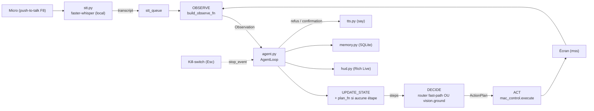
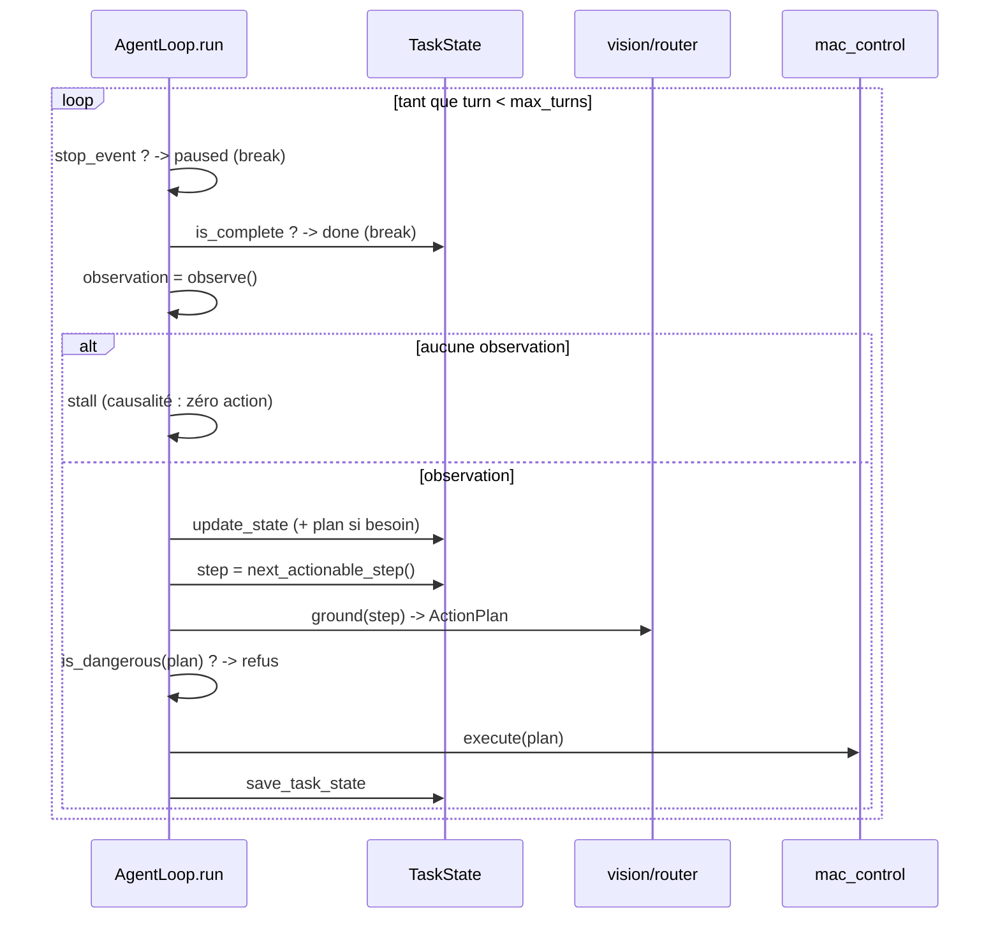
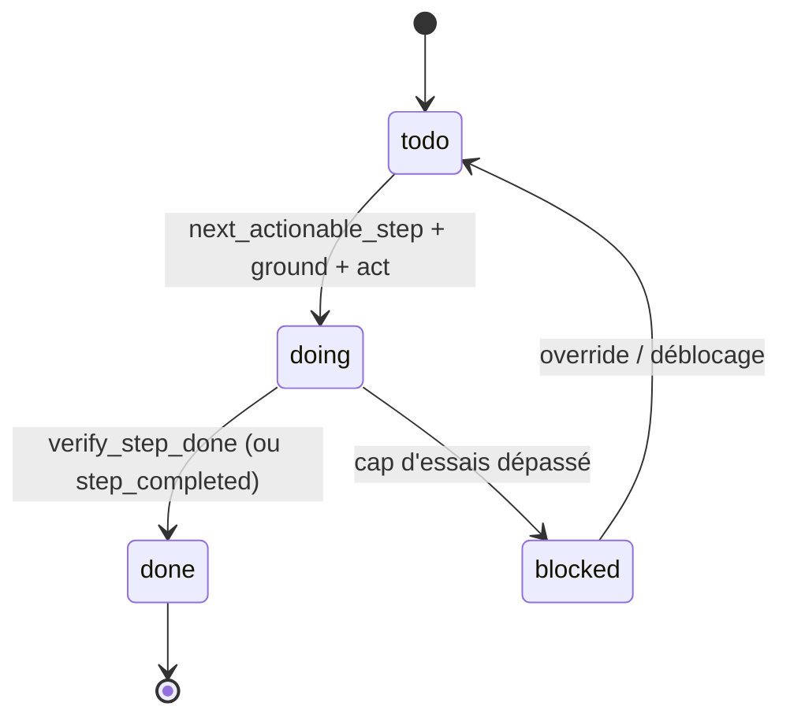

# Architecture — Continuum (« Fil »)

Agent macOS déclenché à la voix qui pilote le vrai poste (souris, clavier, écran)
et tient un **état de tâche persistant** : il ne repart pas d'un instantané, il
reprend une tâche longue et apprend des corrections humaines.

Le produit vit dans **`python-desktop/`** (Python, poste macOS) : entièrement
testable en headless (pytest + dry-run sans clé API, sans écran, sans micro),
puis branchable en live avec une clé Gemini et les permissions macOS.

---

## 1. La primitive porteuse : le hold-state

Tout tient autour d'un objet vivant, `TaskState` (`state.py`) :

| Champ | Rôle |
|---|---|
| `goal` | l'objectif énoncé |
| `steps[]` | plan ordonné ; chaque `Step` a `id`, `desc`, `status` (todo/doing/blocked/done), `note` |
| `facts[]` | ce que l'agent a observé/entendu |
| `overrides[]` | corrections humaines apprises en direct (`when` → `rule`) |
| `open_questions[]` | ambiguïtés non résolues |
| `session_count` | incrémenté à **chaque reprise** — preuve qu'on relit une vraie histoire, pas un snapshot |
| `status` | active / paused / done |

**Règle load-bearing** : l'agent ne choisit JAMAIS une action depuis une observation
brute. Il la choisit **uniquement** via `TaskState.next_actionable_step()` (l'étape
`doing` en cours, sinon la première `todo`). C'est ce qui rend l'état — et pas un
screenshot figé — responsable du comportement.

---

## 2. Le flux bout-en-bout

Étapes concrètes d'un tour :

1. **Déclencheur** — `stt.PushToTalkListener` (`pynput`) : tant que `PTT_KEY` (F8)
   est maintenue, `sounddevice` enregistre ; au relâchement, `faster-whisper`
   transcrit en local et pousse le texte dans `stt_queue`.
2. **OBSERVE** (`main.build_observe_fn`) — lit `stt_queue` en non-bloquant + capture
   un screenshot logique (`mac.capture_screenshot_logical`). Renvoie une observation
   **s'il y a une nouvelle parole OU une étape à faire** (un plan actif avance alors
   tour après tour en regardant l'écran). **Ni parole ni plan → `None`** : l'état gèle
   (causalité : sans intention, aucune action).
3. **UPDATE_STATE** (`agent._update_state`) — replie l'observation dans l'état :
   - instruction destructive → **refus** (voix) et le tour s'arrête ;
   - sinon `add_fact("heard: …")` ;
   - **si aucune étape actionnable → `plan_fn`** décompose l'instruction en étapes
     (`vision.plan_steps` appelle Gemini) et les ajoute via `TaskState.add_steps` ;
   - `step_completed` éventuel → marque l'étape `done`.
4. **DECIDE** (`main.build_ground_fn`, 2 niveaux) :
   - **tier 1, zéro-LLM** : `router.route(step.desc)` — un « open Slack » devient un
     `open_app`/`open_url` sans appel Gemini ;
   - **tier 2, vision** : sinon `vision.ground` envoie le screenshot + l'étape à
     Gemini, qui renvoie **une action JSON** — `click` (boîte `[ymin,xmin,ymax,xmax]`
     0-1000 → pixel), `type` (texte à taper), ou `hotkey` (combinaison).
5. **Garde sécurité** — le plan est re-passé dans `is_dangerous()` avant d'agir.
6. **ACT** (`mac_control.execute`) — click / type (via presse-papier) / hotkey /
   scroll / open_app / open_url sur le vrai Mac (`pyautogui`, `subprocess open`).
7. **Persistance & HUD** — `memory.log_tool` + `save_task_state` + trajectoire ;
   `hud.update` redessine le panneau d'état et le flux d'actions.
8. **Progression** — au tour suivant, `vision.verify_step_done` juge sur le **nouveau**
   screenshot si l'étape est faite → `done` → étape suivante. Un plan actif fait donc
   avancer la boucle **tout seul**, avec un **cap d'essais** par étape (au-delà →
   `blocked`, on passe à la suivante) pour ne jamais boucler à l'infini.

**Kill-switch** : `Esc` (pynput) arme `stop_event`, testé en tête de chaque tour →
statut `paused` **persisté** → repris plus tard avec `--resume`.

---

## 3. La boucle et sa causalité

Quatre invariants prouvés en headless (`scripts/dry_run.py`, `tests/`) :

- **Causalité** : ni parole ni plan actif → aucune action (scénario 4).
- **Planning** : une tâche neuve part vide ; sans `plan_fn` elle stalle pour
  toujours, avec `plan_fn` la première instruction devient des étapes actionnables
  (scénario 7, `tests/test_planning.py`).
- **Progression** : une fois planifié, `verify_fn` (Gemini juge la complétion sur le
  screenshot) fait avancer la boucle d'étape en étape, avec un **cap d'essais** →
  `blocked` (`tests/test_planning.py`).
- **Refus** : une instruction destructive n'atteint jamais l'actionneur (scénario 5).

---

## 4. Cycle de vie de l'état & reprise

- **`apply_override(when, rule)`** ne recalibre QUE les étapes non terminées dont la
  description/note matche `when` ; les étapes `done` restent intactes (l'histoire
  reste honnête).
- **`resume()`** incrémente `session_count` et réactive une tâche `paused`. Appelé à
  chaque `--resume`, il prouve qu'on relit l'histoire réelle.

**Mémoire (`memory.py`, SQLite)** : tables `task_state`, `memory` (KV), `task_log`
(chaque appel d'outil), `trajectories`. `resume_task_state` relit l'état ET bumpe la
session ; `load_startup_context` sert de contexte de démarrage.

---

## 5. Sécurité

`router.is_dangerous()` est une blocklist regex conservatrice (ex : `rm -rf`, `sudo`,
`supprime tout`, `empty trash`, `format disk`, `shutdown`…), volontairement encline
au faux positif (demander confirmation) plutôt qu'au faux négatif. Elle est vérifiée
**deux fois** : sur l'instruction entrante (UPDATE_STATE) et sur le plan d'action
avant l'ACT. Un refus est verbalisé (`tts`) et journalisé, jamais exécuté.

---

## 6. Grounding & pièges écran

- Boîte Gemini normalisée `[ymin, xmin, ymax, xmax]` sur 0-1000 → centre →
  `denormalize_box` → pixel logique.
- **Retina** : `mss` capture en pixels physiques, `pyautogui` clique en points
  logiques. On redimensionne le screenshot à la résolution **logique** AVANT de
  l'envoyer à Gemini : le facteur d'échelle vaut alors 1.0 et le clic tombe juste.
- Budget de contexte : seuls les **3 derniers** screenshots restent en contexte.
- Actions produites par le grounding : `click` (boîte), `type` (texte), `hotkey`.
- **Résilience** : l'appel Gemini (`vision._generate`) porte un **timeout** explicite,
  un **retry** avec backoff et un **circuit-breaker** (trop d'échecs consécutifs →
  coupure courte) — conforme à la règle « appels sortants » du projet.
- Modèle par défaut : `gemini-3.5-flash` (Computer Use natif) ; fallback
  `gemini-2.5-flash` ou legacy `gemini-2.5-computer-use-preview-10-2025`, pilotable
  par `MODEL_NAME` dans `.env` (voir `CONNECTEURS-VERIF-2026-07-05.md`).

---

## 7. Testabilité & ce qui reste à faire sur le Mac

Chaque collaborateur (observe, plan, ground, act, speak, hud) est **injecté** comme
un simple callable ; toutes les libs GUI/réseau (`google-genai`, `pyautogui`, `mss`,
`sounddevice`, `faster-whisper`, `pynput`) sont importées **paresseusement**. D'où :
`pytest`, `scripts/dry_run.py` et `python -c "import main"` tournent **sans clé ni
écran ni micro**, avec des fakes.

**Ce que le headless NE valide PAS (TODO(tom), sur le Mac) :**

- vrai appel Gemini (remplacer le placeholder `GEMINI_API_KEY` par une clé valide —
  attention aux clés restreintes, cf. le RUNBOOK) ;
- vrai clic à l'écran + vrai micro ;
- accorder les 3 permissions macOS (Accessibilité, Enregistrement d'écran, Micro).

**Limites honnêtes :**

- **Jamais tourné en live** : tout est prouvé headless (43 tests + dry-run). Le vrai
  passage clé/écran/micro reste `TODO(tom)`.
- **Override live** : `apply_override` et la recalibration sont réels et prouvés au
  niveau `state`/dry-run, mais **classifier automatiquement une phrase live** comme
  « règle de correction » (vs. nouvelle instruction) reste à affiner (`TODO`).
- **Complétion d'étape** : elle repose sur le jugement de Gemini (`verify_step_done`),
  à roder sur l'app cible réelle (qualité du prompt, bruit visuel).

Planning, progression étape-par-étape, actions `click`/`type`/`hotkey`, résilience
réseau et sécurité sont, eux, câblés de bout en bout.

---

## 8. Carte des modules (Variante A)

| Module | Rôle |
|---|---|
| `config.py` | `Settings` pydantic — toute valeur pilotée par `.env`, zéro `os.getenv` ailleurs |
| `state.py` | **le hold-state** (`TaskState`, `Step`, `Override`) |
| `memory.py` | persistance SQLite (state / KV / log / trajectoires) |
| `router.py` | `is_dangerous()` + fast-paths zéro-LLM (`open app/url`) |
| `vision.py` | **cerveau** Gemini : `plan_steps` (planning) + `ground` (grounding) |
| `mac_control.py` | **actionneur** : denormalize, capture Retina, `pyautogui`, presse-papier |
| `agent.py` | la boucle OBSERVE→UPDATE_STATE→DECIDE→ACT (injection de dépendances) |
| `stt.py` | push-to-talk + enregistrement + transcription locale |
| `tts.py` | synthèse vocale (`say`, fallback `pyttsx3`) |
| `hud.py` | HUD terminal (Rich Live) : panneau état + flux d'actions |
| `main.py` | entrypoint : câblage + threads + `--resume` |
| `scripts/dry_run.py` | preuve headless des 8 invariants |
